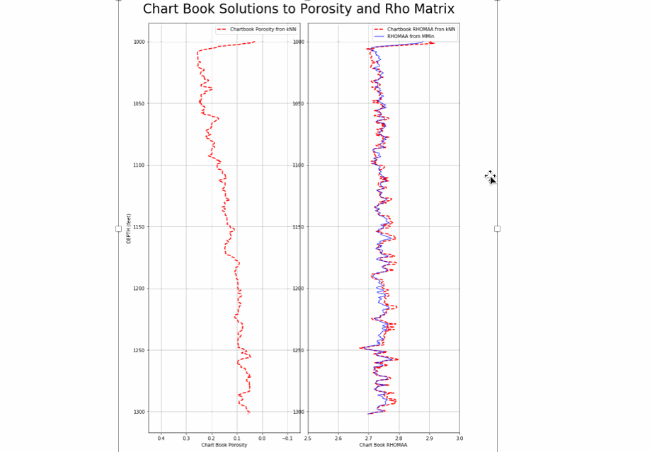

## Hi there 👋

<!--
**Philliec459/Philliec459** is a ✨ _special_ ✨ repository because its `README.md` (this file) appears on your GitHub profile.

Here are some ideas to get you started:

- 🔭 I’m currently working on ...
- 🌱 I’m currently learning ...
- 👯 I’m looking to collaborate on ...
- 🤔 I’m looking for help with ...
- 💬 Ask me about ...
- 📫 How to reach me: ...
- 😄 Pronouns: ...
- ⚡ Fun fact: ...
-->

This is the personal GitHub profile for E. Craig Phillips who has his own company named Crested Butte Petrophysical Consultants. Craig is a Petrophysicist with 40 years of experience that specializes in NMR log interpretation, core-log integration, and full-field Petrophysical Characterization studies. About 2 years ago he started working with python and recognized the value of delivering open-source packages to industry to give back for all the great years that he has had in this industry. This section is still work in progress. 

Most of the repositories are petrophysically oriented, but there are some repositories that are examples of using AI/ML for Marine Object Detection (ships, boats, buoys, and land) too. 

Some of the newer repositories are on the following subjects:
-	A new Shaley-Sand Log Analysis Tutorial written as a Jupyter Notebook that contains the code along with documentation for a typical shaley-sand  analysis.
-	A complete Carbonate Reservoir Characterization Workflow using Ed Clerke’s Arab D Rosetta Stone carbonate core database as calibration also written in 2 Jupyter Notebooks with full documentation.
-	A complete Geolog Project for an Arab D well using the above Carbonate Reservoir Characterization Workflow. 
-	Altair is used extensively in many or our repositories to interrogate our petrophysical data for both Core Calibration and Log data. 
-	We also have a few repositories on using Altair to better understand the dynamic production and pressure data from the Volve Field.
-	There is much more to come ….

Constructive criticism and any collaboration are both welcome. 

