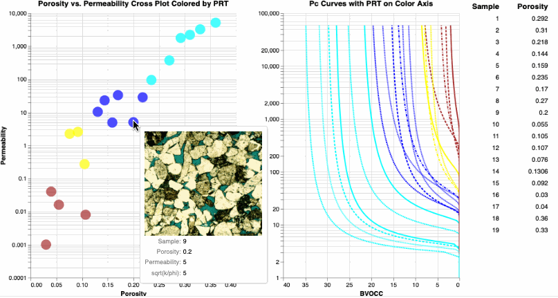
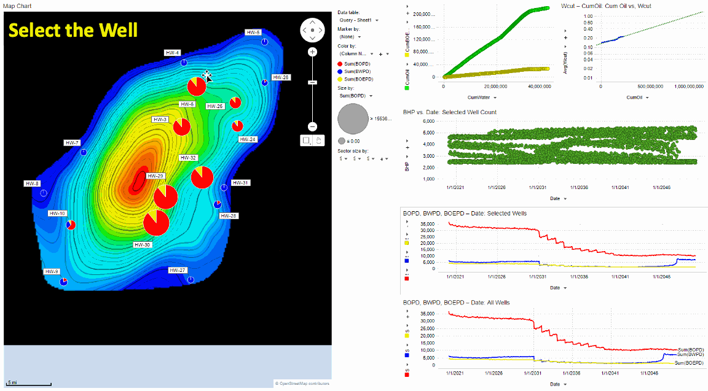
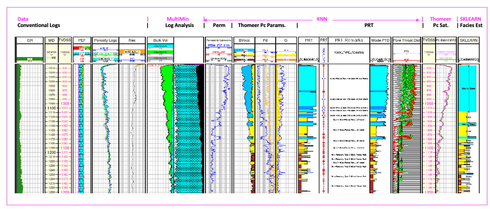
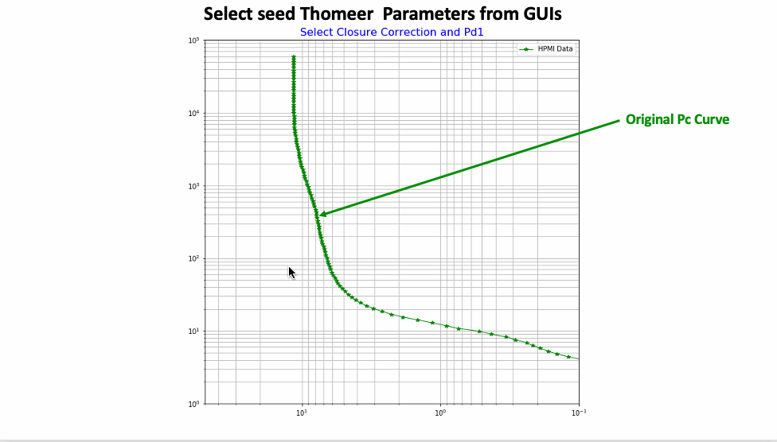
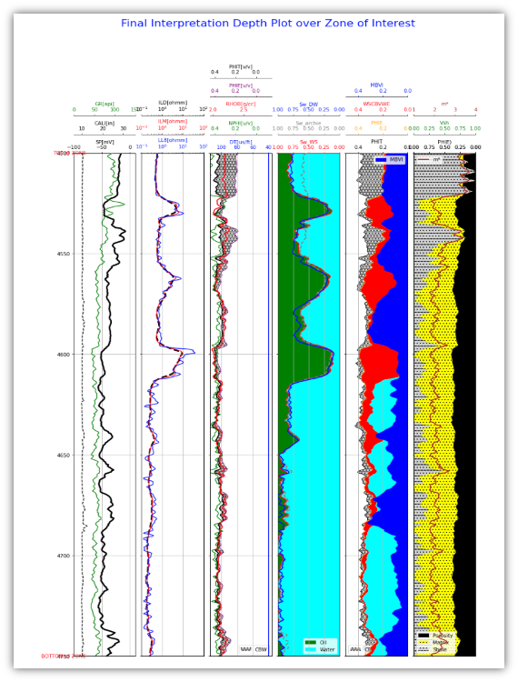

## Welcome 👋

<!--
**Philliec459/Philliec459** is a ✨ _special_ ✨ repository because its `README.md` (this file) appears on your GitHub profile.

Here are some ideas to get you started:

- 🔭 I’m currently working on ...
- 🌱 I’m currently learning ...
- 👯 I’m looking to collaborate on ...
- 🤔 I’m looking for help with ...
- 💬 Ask me about ...
- 📫 How to reach me: ...
- 😄 Pronouns: ...
- ⚡ Fun fact: ...
-->

We would like to welcome you to the GitHub site for E. Craig Phillips. Craig has over 40 years of experience as a Petrophysicist in the Oil and Gas industry. Many of those years were spent in applied research that culminated with the experience gained working in the Reserves Assessment and the Geologic Modeling Groups at Saudi Aramco. Craig had the fortunate experience to characterize, and 3D model most of the Giant oil and gas reservoirs in Saudi working on a team with Ed Clerke, Jan Buiting, Ramsin Eyvazzadeh, and Stephen Cheshire. 

Craig is now developing python software where we can all exploit some of the most recent open-source python libraries that have been developed in recent years. Craig specializes in NMR log interpretation, core-log integration, and full-field Petrophysical Characterization studies, and these GitHub repositories reflect this experience. Craig is getting older and recognizes the need and value of delivering open-source software to industry as a way to give back to this industry for all the great years that he has had in this business.

Most of the repositories are petrophysically oriented, and many are designed to be used with Emerson's Geolog software using python loglans and Jupyter Notebooks as help files. There are also complete Geolog projects with python loglans available here too. One [Geolog Project](https://github.com/Philliec459/Geolog-Used-to-Automate-the-Characterization-Workflow-using-Clerkes-Rosetta-Stone-calibration-data) demonstrates a proven Carbonate Petrophysical Characterization Workflow used to characterize the Arab D carbonate reservoirs of Saudi Arabia using Ed Clerke's Rosetta Stone core database as calibration. The other [Geolog Project](https://github.com/Philliec459/Geolog-Used-to-Model-Thomeer-Parameters-from-High-Pressure-Mercury-Injection-Data) can be used to model High Pressure Mercury Injection core data for the Thomeer parameters to model reservoir saturations using Capillary Pressure. 

However, you will also find some off-the-wall repositories using Deep Learning for ⚡[Marine Object Detection](https://github.com/Philliec459/Jetson-Inference-Pytorch-SSD-used-to-Detect-Marine-Objects-using-JP4.4) to identify ships, boats, buoys, and land mass from a live video feed sailing. In the image below we are not performing object detection on the land, but we are performing object detection on 'boats' and 'buoys', and there are no 'buoys': 
>
>**Figure) Sailboat Object Detection using Pytorch.**
>
>This project was implemented on an Island Packet 420 Sailing Vessel using a Jetson NX minicomputer for the video Object Detection. One of the benefits of being able to write your own software is that if you need it, then do it.

### The following is a partial list of available repositories that will give you a flavor of some of the projects available at this GitHub site. Please see all of the GitHub repositories using this link [Repositories]( https://github.com/Philliec459?tab=repositories).
- We have a new [NMR repository](https://github.com/Philliec459/NMR-Echo-Train-Inversion-to-created-a-typical-NMR-log) that demonstrates how we can use python SciPy curve_fit for NMR Echo Train T2 inversion to create an NMR log:
>
>     def func(x,p1,p2,p3,p4,p5,p6,p7,p8):
>    
>        return (p1*np.exp(-x/4)+p2*np.exp(-x/8)+p3*np.exp(-x/16)+p4*np.exp(-x/32)+p5*np.exp(-x/64)+p6*np.exp(-x/128)+p7*np.exp(-x/256)+p8*np.exp(-x/512))
>
>     popt, pcov = curve_fit(func, xdata, ystack, method='trf', bounds=(0.05, [20, 20, 20, 20, 20, 20, 20, 20]))
>
> This is a rather unorthodox approach, but it does demonstrate how an NMR log is created from the NMR Time-Domain Echo Train data. With the code in this repository, you can control the Echo Train noise, by adding additional random noise to the Time Domain data; and also apply Echo Train stacking to improve the S/N at the expense of lower NMR log resolution. The following animated gif illustrates how the program processes each Echo Train to create the T2 distribution and then the NMR log. This type of visual NMR Time-Domain processing was inspired by the software designed by Dan Georgi, formerly with Baker Atlas. Dan wanted his Echo Train inversion software to be visual and intuitive to use, and it was. An added benefit was that it was quite obvious if there was a problem with the number of echoes being acquired or not enough bins employed in the inversion process. We have tried to capture some of Dan's objectives in this python example.
>
>
>**Figure) Construct an NMR log using Time-Domain Echo Train inversion.**
- We have a new repository that uses Altair and Panel to allow us to [interrogate](https://github.com/Philliec459/View-Thin-Section-Images-from-a-Porosity-Permeability-Cross-Plot-using-Python-Altair) Routine Core Analysis (RCA) and SCAL data using Thin Section images in the process to better understand the texture of the rock. We have also added a Geolog project with python loglans to provide this same application in Geolog. This was not at all straight forward coding since only Jupyter Notebooks will display (render) the Thin Section images directly. Instead, we are using an alternative solutions to render the Thin Section images for Geolog, JupyterLab Notebooks and even .py files. 
>
>
>**Figure) Use of Thin Sections to help us better understand the texture of our reservoir.**
-	In our GitHub repository we have used a new, comprehensive reservoir characterization database from Costa, Geiger and Arnold(1) located at the following link where you will find our [Jupyter Notebooks](https://github.com/Philliec459/Jupyter-Notebooks_for-Characterization-of-a-New-Open-Source-Carbonate-Reservoir-Benchmarking-Case-St). We have employed all the available 17 well logs, Routine Core Analysis (RCA) and Special Core Analysis (SCAL) and implemented our typical carbonate reservoir characterization workflow as discussed by Phillips (2). 
>
>
>**Figure) Complete Carbonate Reservoir Characterization process.**
>
> For this repository we did not use the 3D static or dynamic models, but we did employ the time-series dynamic production and formation pressure data by well in both Spotfire and python Altair to better understand the dynamic aspects of this reservoir. This is a rich dataset that needs to be explored further, more than what is presented within the scope of this project. We also have a complete [Geolog Project](https://github.com/Philliec459/Characterization-of-a-New-Open-Source-Carbonate-Reservoir-Benchmarking-Case-Study-by-Costa) with the same data and our python loglans which use the same code as in our Jupyter Notebooks. The Geolog project also has the SCAL dataset available with the python coding to create Capillary Pressure curves from Thomeer parameter and assess the Thomeer parameter correlations. 
-	We have a complete carbonate (Arab D) Reservoir Characterization Workflow available in a [Geolog Project](https://github.com/Philliec459/Geolog-Used-to-Automate-the-Characterization-Workflow-using-Clerkes-Rosetta-Stone-calibration-data). We are using python loglans with Ed Clerke’s Arab D Rosetta Stone carbonate core database as the calibration data. We also have a corresponding repository with 2 Jupyter Notebooks that can be used as [Help Files](https://github.com/Philliec459/NEW-Carbonate-Characterization-Workflow-Jupiter-Notebook-Modules-with-Clerke-Arab-D-Calibration-Data) to provide full documentation to explain each step of this characterization process. There is a third Notebook too that estimates Petrophysical Rock Types (PRT) using Sklearn, but we prefer the kNN method proposed in the second Notebook. 
>
>
>**Figure) Arab D Carbonate Reservoir Characterization Workflow using Clerke's Rosetta Stone Arab D carbonate data for calibration.** 
-	We have a new [Geolog Project](https://github.com/Philliec459/Geolog-Used-to-Model-Thomeer-Parameters-from-High-Pressure-Mercury-Injection-Data) used for Thomeer Parameter Analysis of High Pressure Mercury Injection (HPMI) core data using SciPy curve-fit written in a Geolog python loglan. This loglan estimates the Thomeer Capillary Pressure parameters for the Thomeer hyperbola to model the HPMI Capillary Pressure data and then used to estimate Capillary Pressure saturations in the reservoir. We also have the corresponding python code in a Jupyter Notebook with complete documentation to be used as a help file for this Geolog Thomeer Analysis [Help Files](https://github.com/Philliec459/Thomeer-Used-to-Model-High-Pressure-Mercury-Injection-Core-Data). 
>
>
>**Figure) Fit High Pressure Mercury Injection data to a Thomeer hyperbola to determine the Thomeer Capillary Pressure parameters for each sample.** 
-	A new [Shaley-Sand Log Analysis Tutorial](https://github.com/Philliec459/NEW-Shaley-Sand-Log-Analysis-Tutorial-using-Combined-NMR-and-Conventional-Logs) written as a Jupyter Notebook in python that contains the code along with documentation for a typical shaley-sand  analysis. This could be used as a stand-alone software or implemented in other Petrophysical software packages. This program uses George Coates' MRIAN type analysis using Dual Water saturations as well as Waxman-Smits saturations too. 
>
>
>**Figure) Combined Conventional and NMR Logs used in a Shaley-Sand log analysis example similar to Coates' MRIAN analysis.** 
-	Altair is used extensively in many or our repositories to interrogate our petrophysical data for both [Core Calibration](https://github.com/Philliec459/Altair-used-to-Select-Samples-from-Poro-Perm-Cross-Plot-to-Display-the-respective-Pc-Curves) and [Log](https://github.com/Philliec459/Geolog-Python-Loglan-use-of-Altair-to-Interrogate-Log-Analysis-data) data. Altair is a python library that allows for great interactivity using your dynamically linked data. 
-	We also have a few repositories using Altair again to better understand the reservoir’s dynamic data (production and pressure) from the [Volve Field](https://github.com/Philliec459/Altair-used-to-Visualize-and-Interrogate-well-by-well-Production-Data-from-Volve-Field). 
-	You will also find other notable repositories from others that have been forked into this site through GitHub too.
-	There is much more to come …

### Constructive criticism and any collaboration are both welcome. We value your input.  
